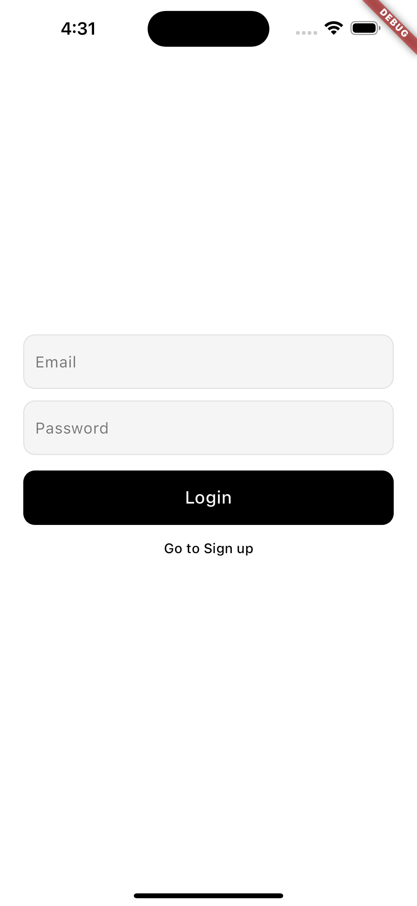
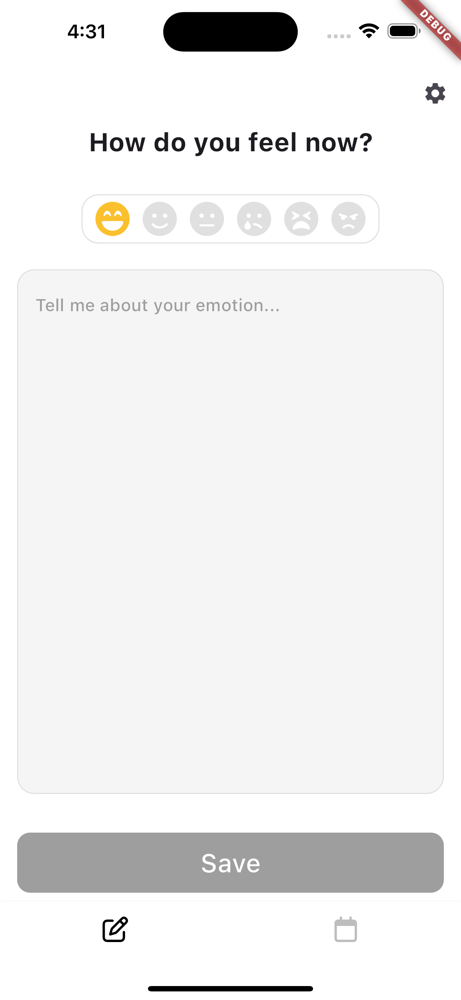
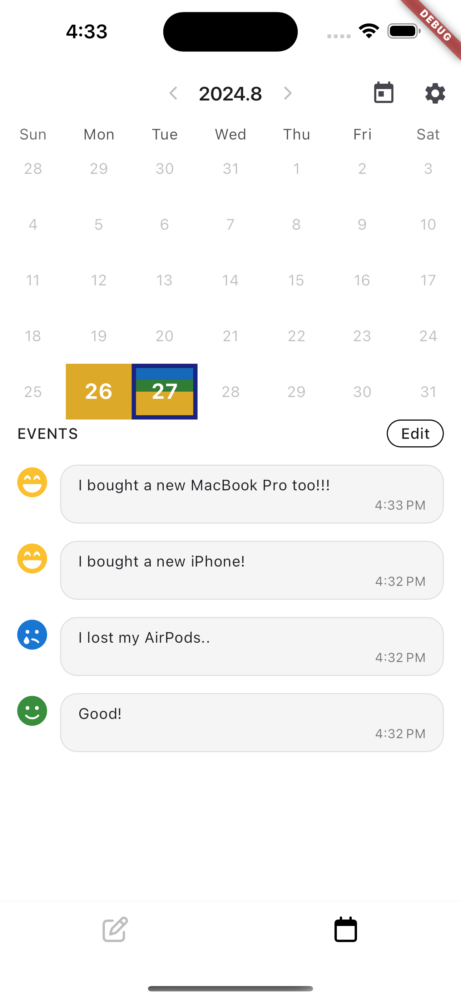
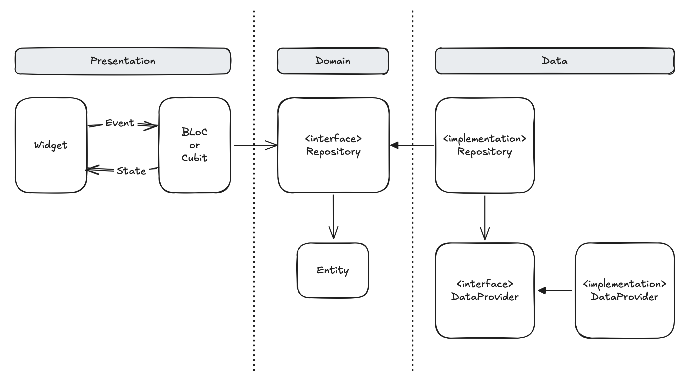
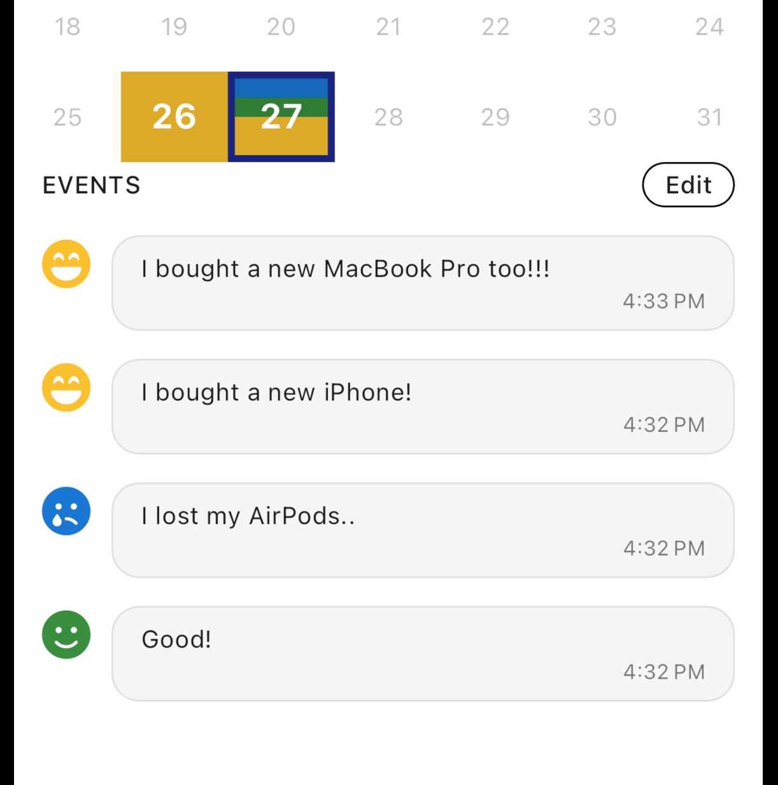

# Moodtracker

## Summary

- 사용 기술
  - Dart
  - Flutter
  - Firebase Auth
  - Firestore
  - Firebase Storage
- 상태 관리
  - Riverpod -> BLoC
- Packages
  - `table_calendar` : custom calendar 구현
  - `flutter_bloc` : BLoC pattern 구현
  - `intl` : `DateFormat`을 사용하여 날짜 format 변경
- 주요 기능
  - Sign in, sign up, sign out
  - 감정 메모를 firestore에 저장
  - Firestore data를 가져와서 calendar로 시각화
  - Calendar에 날짜 별로 기록한 감정들을 비율 별로 색상 표시

## Results

|                      로그인                       |                      글쓰기                       |                      달력 조회                       |
| :-----------------------------------------------: | :-----------------------------------------------: | :--------------------------------------------------: |
|  |  |  |

## Structures

### Architecture



- BLoC 문서에서 소개하는 layered architecture와 clean architecture의 의존성 방향을 고려하여 구조 설계
- 의존성 방향이 안정된 domain layer로 향하도록 repository interface를 사용해서 의존성 역전
- DateProvider에도 interface를 사용하여 의존성을 역전시켜 변경에 유연하도록 설계

### Folder structure

```
lib
ㄴ features
  ㄴ feature_a
    ㄴ data
      ㄴ data_providers
      ㄴ repositories (implementation)
    ㄴ domain
      ㄴ entities
      ㄴ repositories (interfaces)
    ㄴ presentation
      ㄴ blocs
      ㄴ views
```

## Features

### Data modeling

위 시나리오에서 data model은 '감정 일기' data 하나만 필요하다. 이 model은 다섯 가지 field를 갖는다.

| Field       | Description                                                                                 |
| ----------- | ------------------------------------------------------------------------------------------- |
| id          | Firestore에 저장되는 document id. Data 삭제를 위해 저장한다.                                |
| userId      | 사용자 ID. Document를 사용자 별로 구분할 수 있도록 user id를 path로 사용한다.               |
| emotion     | 감정을 나타내는 key string                                                                  |
| description | 감정과 함께 저장할 memo                                                                     |
| date        | 저장한 날짜. Flutter의 `DateTime` type을 Firebase의 `Timestamp` type으로 변환해서 저장한다. |

사용자가 자신의 data에 빠르게 접근할 수 있도록  `users/:userId/posts/:postId` path로 저장한다.

```
users (collection)
ㄴ {user id} (document)
  ㄴ posts (nested collection)
    ㄴ {post id} (document)
```

### Calendar Visualization

<div align="center"></div>

- `table_calendar` package가 제공하는 `TableCalendar` widget을 customizing하여 기록한 감정들을 월별, 일별로 한 눈에 보면서 요즘 기분이 어떤지 쉽게 확인할 수 있도록 시각화
- 감정 별로 색상을 부여하고, calendar의 날짜 칸에 기록한 감정들을 색상으로 표시
- 특정 날짜에 기록한 감정들의 비율을 계산한 뒤, `Expanded` widget을 사용해서 비율에 따라 calendar의 day cell을 다른 색상을 채우도록 구현
  - 위 예시에서는 1:1:2 비율로 색상 표시
  - 27일에 좋은 감정을 더 많이 느꼈다는 것을 알 수 있다.
- 비율에 따라 감정 빈도 수를 나타내는 `Expanded` widget 생성
  ```dart
  List<Widget> _dayBackgroundWidgets(Iterable<Post> posts, DateTime day) {
    // 1. Post list로부터 emption 등장 횟수 계산
    final fractions = _fractionOfEmotions(posts);
    // 2. 등장 횟수 오름차순으로 정렬
    final sortedEntries = fractions.entries.toList()
      ..sort((a, b) => a.value.compareTo(b.value));
    // 3. 등장 횟수를 `flex`로 갖는 `Expanded` widget으로 변환
    return sortedEntries
      .map<Widget>(
        (entry) => Expanded(
          flex: entry.value,
          child: ColoredBox(color: entry.key.tintColor),
        ),
      )
      .toList();
  }
  ```
